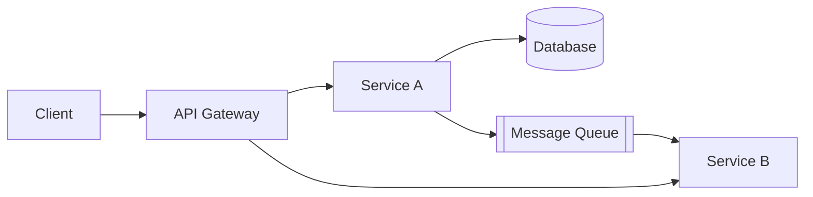

# [System Name] --- System Design Document

**Author:** [Name]
**Date:** [YYYY-MM-DD]
**Status:** Draft | In Review | Approved
**Reviewers:** [Names or roles]

---

## 1. Context & Motivation

[Why does this system need to exist? Reference the PRD or business driver. State what currently exists (if anything) and why it is insufficient. 3-5 sentences.]

---

## 2. Goals & Non-Goals

### Goals

1. [Specific, verifiable outcome]
2. [Specific, verifiable outcome]
3. [Specific, verifiable outcome]

### Non-Goals

1. [Thing this design explicitly does NOT address]
2. [Thing this design explicitly does NOT address]

---

## 3. Non-Functional Requirements

| Requirement | Target | Rationale |
|-------------|--------|-----------|
| Availability | [e.g., 99.9%] | [e.g., Customer SLA] |
| P99 latency | [e.g., < 200ms] | [e.g., User-facing endpoint] |
| Throughput | [e.g., 5,000 req/s peak] | [e.g., Peak traffic projection] |
| Data retention | [e.g., 90 days hot, 2 years cold] | [e.g., Compliance requirement] |
| RPO / RTO | [e.g., RPO 1 min, RTO 5 min] | [e.g., Business continuity] |

---

## 4. Architecture Overview

[High-level diagram (Mermaid, ASCII, or image link). Show major components, data flow direction, and external dependencies. Label sync vs. async communication. Every box must appear in Section 5.]



---

## 5. Component Design

### 5.1 [Component Name]

- **Responsibility:** [One sentence. If you need "and", split the component.]
- **Interface:** [API, queue consumer, cron, etc.]
- **Dependencies:** [Other components or external services]
- **Scaling strategy:** [Horizontal auto-scale, vertical, static]
- **Key design decisions:** [Brief notes or reference to ADR]

### 5.2 [Component Name]

- **Responsibility:**
- **Interface:**
- **Dependencies:**
- **Scaling strategy:**

[Repeat for each component in the architecture diagram.]

---

## 6. Data Model

### Entities

[ER diagram or table definitions for key entities.]

### Storage Choice

- **Database:** [e.g., PostgreSQL, DynamoDB]
- **Justification:** [Why this database for this workload]

### Indexing Strategy

- [Index 1: columns, purpose, expected query pattern]
- [Index 2: columns, purpose, expected query pattern]

### Partitioning / Sharding

[Approach and partition key, if applicable. If not needed at current scale, state so.]

---

## 7. API Contracts

### [Endpoint Name]

```
[METHOD] [/path]
```

**Request:**
```json
{
  "field": "type — description"
}
```

**Response (200):**
```json
{
  "field": "type — description"
}
```

**Error codes:**
| Code | Meaning |
|------|---------|
| 400 | [Description] |
| 401 | [Description] |
| 404 | [Description] |
| 429 | [Description] |

**Auth:** [Method]
**Rate limit:** [Limit]

[Repeat for each external or cross-service API.]

---

## 8. Failure Modes & Mitigation

| Failure | Impact | Detection | Mitigation | Recovery Time |
|---------|--------|-----------|------------|---------------|
| [e.g., DB primary down] | [e.g., Writes fail] | [e.g., Health check] | [e.g., Auto-failover to replica] | [e.g., ~30s] |
| [e.g., Upstream API 5xx] | [e.g., Degraded results] | [e.g., Error rate monitor] | [e.g., Circuit breaker + cache] | [e.g., Automatic] |
| [e.g., Queue backlog] | [e.g., Delayed processing] | [e.g., Queue depth alarm] | [e.g., Auto-scale consumers] | [e.g., Minutes] |

---

## 9. Security Considerations

### Authentication & Authorization

[Auth model: API keys, OAuth, JWT, service mesh mTLS, etc.]

### Encryption

- **At rest:** [Method]
- **In transit:** [Method]

### Sensitive Data

[How PII, secrets, and audit logs are handled.]

### Attack Surface

[Rate limiting, input validation, injection prevention, CORS policy, etc.]

---

## 10. Migration & Rollout Plan

*Optional --- include if replacing an existing system.*

- **Strategy:** [Big bang / Strangler fig / Dual-write / Blue-green]
- **Feature flags:** [How rollout is controlled]
- **Rollback plan:** [How to revert if the rollout fails]
- **Data migration:** [Steps, estimated duration, validation approach]
- **Timeline:** [Phased rollout schedule]

---

## 11. Architecture Decision Records

### ADR-001: [Decision Title]

**Status:** Accepted
**Context:** [What problem or tradeoff prompted this decision]
**Decision:** [What was decided]
**Consequences:** [What this enables and what it costs]

[Add more ADRs as needed. See `assets/adr-template.md` for the full format.]

---

## 12. Open Questions

| # | Question | Owner | Blocking? |
|---|----------|-------|-----------|
| 1 | [Question] | [Name] | Yes / No |
| 2 | [Question] | [Name] | Yes / No |
